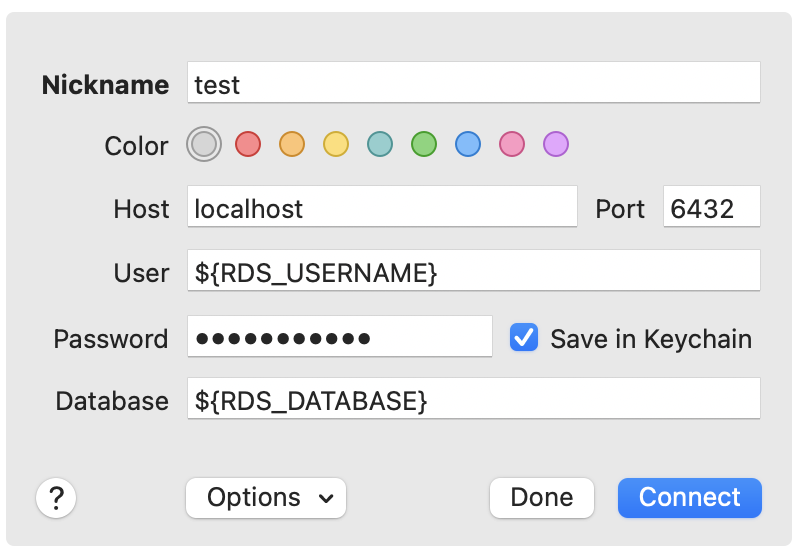

# pgpx
"Single-backend" PostgreSQL proxy for enabling RDS IAM-based authentication with dynamic passwords on Postgres client apps that do not support dynamic credentials.

## How it works

`pgpx` works as a dumb proxy for PostgreSQL with a built-in ability to intercept the auth requests and substitute the authentication password with the dynamic one, generated by the bash command (usually AWS CLI) provided as argument to the script.

## Usage

Here's the 'official' usage output:

```bash
Usage of ./pgpx:
  -credsCmd string
    	Bash command to retrieve temporary database connection password
  -credsOverride
    	Indicates whether to override the password provided through the client application (default true)
  -ignoreUsername
        By default, the tool matches provided username with the one in credsCmd command to decide on overriding the password.
        Set this flag to ignore username matching. (default false)
  -dbCertPath string
    	Absolute path to the database SSL CA certificate (required)
  -pgHostPort string
    	Hostname and port of the PostgreSQL server, e.g. "localhost:5432" (required)
  -proxyHost string
    	Host where pgpx is accepting connections (default "localhost")
  -proxyPort string
    	Port where pgpx is accepting connections (default "6432")
```

## Real-world example

**1. Prepare AWS CLI command to retrieve the dynamic database password**

The typical AWS CLI command to generate the RDS IAM dynamic credentials looks like the below:

```bash
AWS_PROFILE=${AWS_PROFILE} aws --region ${REGION} \
  rds generate-db-auth-token --hostname ${RDS_HOSTNAME} --port ${RDS_PORT} \
  --username "${IAM_USERNAME}" --output text
```

where 
- `AWS_PROFILE` is a name of the AWS profile
- `REGION` is a target AWS region
- `RDS_HOSTNAME` is a host name of the RDS server
- `RDS_PORT` is a port of the RDS server
- `IAM_USERNAME` is the username of the user for whom the credentials are retrieved

**NOTE.** Make sure that RDS_HOSTNAME and RDS_PORT are directly accessible for `pgpx`, otherwise the proxy will not work.

**2. Export the dynamic password command as an env varable**

Just for simplicity, let's export the dynamic password command as a `DYNAMIC_PASSWORD` env var.

```bash
export DYNAMIC_PASSWORD=(AWS_PROFILE=${AWS_PROFILE} aws --region ${REGION} rds generate-db-auth-token --hostname ${RDS_HOSTNAME} --port ${RDS_PORT} --username "${IAM_USERNAME}" --output text)
```

**3. Keep database SSL/TLS certificates handy**

Make sure you know the path to RDS SSL certificate that will be used to establish a secure connection to the database.

The AWS article [Using SSL/TLS to encrypt a connection to a DB instance](https://docs.aws.amazon.com/AmazonRDS/latest/UserGuide/UsingWithRDS.SSL.html) explains how to establish SSL/TLS connection to the database, and provides links to download the certificates for different AWS regions.

Let's assume that you have downloaded and saved the certificate file `us-east-1-bundle.pem` to `~/rds-certs/` directory on your local machine. 

`pgpx` uses **absolute paths** to load the certificate, so let's assume that the absolute path is the following: `/Users/jon_doe/rds-certs/us-east-1-bundle.pem`.

**3. Run pgpx**

`$ ./pgpx --dbCertPath=/Users/jon_doe/rds-certs/us-east-1-bundle.pem --credsCmd=${DYNAMIC_PASSWORD} --pgHostPort=localhost:5432`

where
- `pgHostPort` is the combination of a host and port of your PostgreSQL server (i.e. same as `${RDS_HOSTNAME}:${RDS_PORT}`)

Once started, `pgpx` will show the welcome message:
```json
{"level":"trace","time":"2023-10-04T17:06:28-04:00","message":"Starting PostgreSQL proxy on localhost:6432 ..."}
```

**4. Use client application to connect to PostgreSQL server**

In this example, we will use [Postico](https://eggerapps.at/postico2/) to connect to PostgreSQL server:



- Put the value of `IAM_USERNAME` in the `User` field
- Put your database name in the `Database` field
- Put the `pgpx` proxy hostname in the 'Host' field (default: `localhost`)
- Put the `pgpx` proxy port in the `Port` field (default: `6432`)
- Put **ANY PASSWORD** in the `Password` field (it will be substituted with the dynamically generated password when database connection is established)

Click "Connect", and enjoy using the database connection via RDS IAM authentication.

## Credits

This work is derived from:

* the amazing [pgproxy](https://github.com/encoredev/encore/tree/main/pkg/pgproxy) - a PostgreSQL proxy implementation package by [Encore](https://encore.dev/)
* the awesome [pgconn](https://github.com/jackc/pgconn) - a PostgreSQL protocol implementation by [Jack Christensen](https://github.com/jackc)

